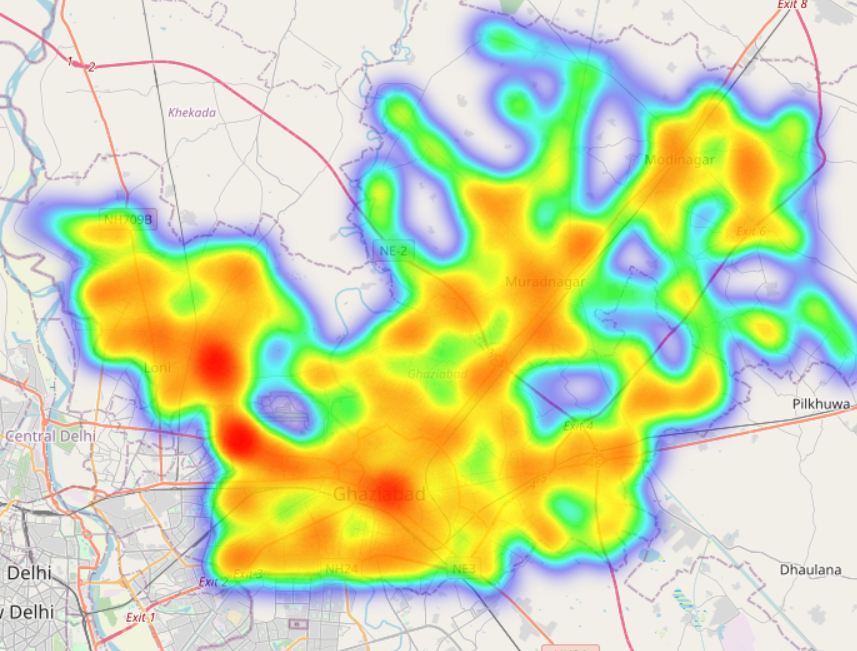
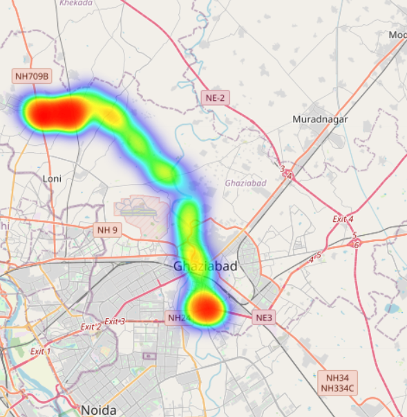

# 🚦 Smart City Congestion Management System  
### A Data-Driven Traffic Optimization and Simulation Platform

---

## 🏙️ Overview

**Smart City Congestion Management** is a full-fledged data analytics and simulation platform that models how a city can manage traffic congestion dynamically using **vehicle traces, graph-based routing, and visualization dashboards**.

The system mimics a real-world **urban traffic control center**, where congestion data is continuously aggregated, analyzed, and optimized to reduce traffic jams and improve flow efficiency.

This project combines **Data Analytics**, **Graph Theory**, and **AI-based Route Optimization** under a single, interactive Streamlit dashboard.

---

## 🚩 Problem Statement

Urban areas face increasing **traffic congestion** due to:
- Poor road utilization,
- Lack of dynamic rerouting systems,
- Static traffic light control, and
- Unoptimized traffic flow management.

### ⚠️ Problem We Solved
We simulated a smart city system that:
1. **Analyzes traffic congestion in real-time** from vehicle traces.  
2. **Detects high-density traffic hotspots.**  
3. **Generates alternate, congestion-avoiding routes** dynamically.  
4. **Assigns reroutes intelligently** based on capacity constraints.  
5. **Visualizes before/after congestion effects** using interactive heatmaps.

The result is an **end-to-end automated pipeline** that shows how urban traffic can be optimized algorithmically — even without real sensors.

---

## 🧩 System Architecture
## ⚙️ Workflow Breakdown (Scripts)

| Step | Script | Description |
|------|---------|-------------|
| 1️⃣ | `02_simulate_traces.py` | Simulates 400+ virtual vehicles traveling in Ghaziabad city using **OSMnx road graph**. Records timestamps, speed, and edge traversals. |
| 2️⃣ | `03_aggregate_congestion.py` | Aggregates vehicle movement every 5 minutes per road edge to compute **vehicle_count**, **average_speed**, and **congestion_score**. |
| 3️⃣ | `05_detect_hotspots.py` | Detects **highly congested roads (top 10%)** and groups them into clusters (hotspot zones). |
| 4️⃣ | `06_candidate_routes.py` | For each affected vehicle, generates **alternate routes** using NetworkX shortest path algorithms:  
   - Avoid-hotspot route  
   - Soft-penalty route  
   - Limited detour route |
| 5️⃣ | `07_assign_routes.py` | Assigns optimal routes to vehicles using a **greedy, capacity-aware strategy** to prevent overloading any single edge. |
| 6️⃣ | `08_dispatch_and_simulate.py` | Simulates traffic after rerouting, comparing **before vs after congestion metrics**, and generates heatmaps (`before_map.html`, `after_map.html`). |

---

## 🧠 Optional ML Component (Predictive Analytics)

A separate machine learning component (`09_train_predictor.py`) was built to predict **next time-window congestion** using **XGBoost** with temporal and static graph features:

- Lag-based temporal patterns  
- Rolling mean and ratio trends  
- Per-edge normalization  
- Edge-wise R² diagnostic tracking  

This part can later enable **predictive rerouting** — turning the simulation into a **proactive traffic control system**.

---

## 🧰 Tech Stack

| Category | Tools / Libraries |
|-----------|------------------|
| **Frontend (UI)** | [Streamlit](https://streamlit.io) — interactive control dashboard |
| **Visualization** | Folium (heatmaps), Plotly (analytics trends) |
| **Backend Logic** | Python (subprocess, Pandas, NumPy) |
| **Graph Processing** | OSMnx, NetworkX |
| **Machine Learning (Optional)** | XGBoost, scikit-learn |
| **Mapping & Geodata** | OpenStreetMap GraphML data |
| **Data Files** | `.csv`, `.json`, `.html` generated dynamically |

---

## 💻 Streamlit Dashboard

### 🎛️ Simulation Dashboard (`app.py`)
- One-click run for **full pipeline** execution.  
- Live progress tracking for each script.  
- Real-time log updates.  
- Interactive **before/after congestion heatmaps**.  
- Modern, responsive UI with color-coded sections.

### 📊 Analytics Dashboard (`analytics_app.py`)
- Visualizes congestion trends over time.
- Shows **top congested roads**, **average speed drops**, and **vehicle count spikes**.
- Uses **Plotly interactive charts** and **Folium maps**.


### 1️⃣ Setup Environment
```bash
git clone <repo>
cd DataAnalyst
python -m venv .venv
.venv\Scripts\activate
pip install -r requirements.txt
streamlit run app.py
streamlit run analytics_app.py

```

## 📊 Example Outputs

| Before Rerouting | After Rerouting |
|------------------|-----------------|
|  |  |

✅ **Traffic hotspots reduced significantly after rerouting.**  
✅ **Load distributed more evenly across the road network.**

---

## 🚧 Challenges Solved

| Challenge | Solution |
|------------|-----------|
| Simulating realistic vehicle movement | Used **OSMnx road graph** + random weighted node sampling |
| Congestion estimation | Dynamic aggregation window of 5 minutes |
| Detecting hotspots | Quantile-based filtering (top 10%) |
| Alternate route generation | Multi-criteria shortest paths |
| Fair route assignment | Capacity-aware greedy selection |
| Visualization | Folium + Streamlit UI with live progress |
| Unicode/encoding crashes | Fixed using UTF-safe logs and encoding in subprocess |

---

## 🔮 Future Enhancements

- 🧠 **Integrate trained ML predictor** to forecast future congestion.  
- 🚦 **Add real-time traffic light control simulation.**  
- 🛰️ **Connect to live GPS or IoT sensor data** for real-world mapping.  
- 📈 **Enable time-lapse playback** of vehicle movement across the city.  
- 🌐 **Host the dashboard** on Streamlit Cloud / AWS / Azure for public access.  

---

## ✨ Author

**Faizal**  
💡 *Engineering Student (CSE - AI)*  
🚀 Passionate about AI-driven smart systems, traffic analytics, and city-scale simulations.  
🔗 [GitHub](https://github.com/faizalspace) 

> *“In a future smart city, data will be the traffic light.  
> This project is the first simulation of that idea.”*

---

yolo achievement
